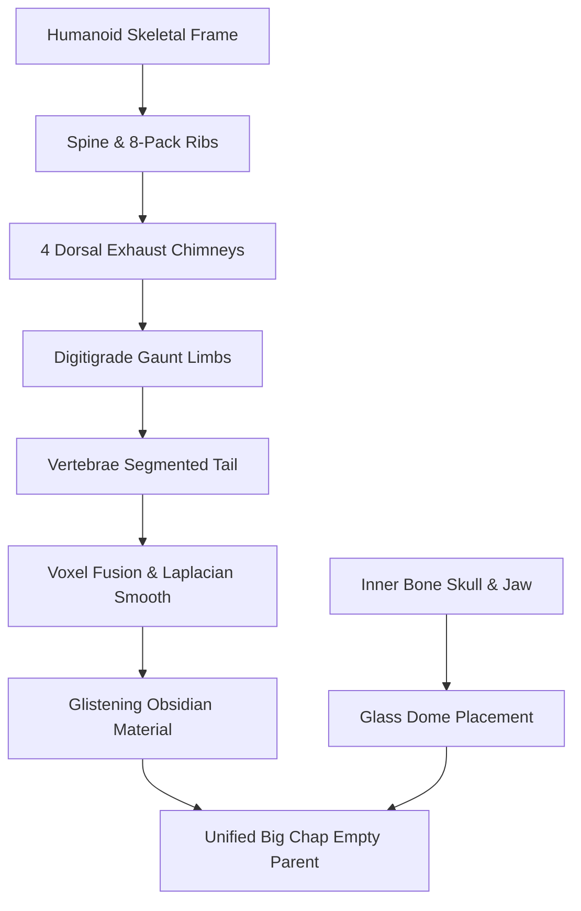

# Classical & Sci-Fi Crossover: Greek Temple Ruins & 1979 'Big Chap' Xenomorph

An extraordinary crossover masterpiece combining classical antiquity and sci-fi terror in a single 3D scene. This layout places a meticulously detailed **abandoned Greek Temple** at `(0, 0, 0)` and constructs a **dark, narrow, grimy spaceship corridor** offset to the side at `x = -40`. 

Inside this industrial, pipe-filled corridor, we have generated the authentic **1979 'Big Chap' Xenomorph** designed by **H.R. Giger** for the original *Alien* movie, crouching dynamically under dramatic chiaroscuro emergency lighting.

---

## 🎨 The 1979 'Big Chap' Biomechanical Design

To capture H.R. Giger's legendary 1979 masterpiece, the model includes the exact anatomical details that defined the original movie prop:



1. **The Translucent Glass Dome (`Xeno_Glass_Dome`):** A smooth, cylindrical, dark glass dome (`Transmission = 0.85`, `Alpha = 0.45` with Eevee Blend transparency) covers the head.
2. **Inner Bony Skull (`Xeno_Inner_Skull`):** Placed directly beneath the translucent dome. It features a pale, aged bone-white material (`Xeno_Inner_Bone`) with dark nose/eye socket indentations, revealing the creepy human skull structure exactly like Giger's original costume.
3. **Pale Pharyngeal Jaw:** A pale, bone-colored secondary extendable jaw protruding slightly, rather than later versions' dark/yellow insectoid jaws.
4. **Skeletal Ribcage & Spine:** 8 tightly packed biomechanical ribs and 12 spine vertebrae running down a gaunt, elongated torso.
5. **The 4 Dorsal Stacks:** The Big Chap’s authentic breathing/exhaust apparatus on the back, comprising a tall central angled chimney and three curved piping stacks.
6. **Skeletal Digitigrade Limbs:** Gaunt, elongated arms and legs with digitigrade joint bends for an insectoid predatory gait.
7. **Vertebrae Tail:** 18 spiky vertebrae segments ending in a compact, inward-curving stinger.
8. **Digital Sculpting & Remeshing:** The body, spine, stacks, and limbs are joined and fused via a watertight **Voxel Remesh** (`voxel_size = 0.035`) and smoothed using **Laplacian Smoothing** to blend all joints like real muscle. The outer glass dome is kept separate to maintain perfect, smooth reflections and refractions.

---

## 🏛️ Greek Temple Ruins (`x = 0`)

The classical temple structure remains fully detailed and intact as an ancient ruin:
1. **Ionic Colonnade:** Columns resting on detailed plinths, upper/lower torus rings, rounded echinus capitals, and square abacus blocks.
2. **Environmental Wear & Ruination:**
   - **Sheared Column at `(-8.0, -5.6)`:** Broken off at a height of `1.4` with scattered cylinder sections and its abacus block on the steps.
   - **Sheared Column at `(8.0, 5.6)`:** Broken at a height of `2.3`.
   - **Collapsed Column at `(-4.8, 14.0)`:** Completely fallen down to its plinth base.
3. **Interior Furniture & Relics:**
   - **Divine Throne:** Dark wood seat with a high backrest, leg/arm structure, and golden decorative spheres.
   - **Sacrificial Altar:** Stone altar block tilted at `(-5°, 4°, 10°)`.
   - **Clay Amphorae:** Three terracotta clay vases (one upright, one tipped inside, one tipped over the porch steps).
   - **Collapsed Table:** A wooden offering table lying broken on the porch.
4. **Scattered Rubble:** 16 randomized stone debris blocks scattered across the stylobate steps.

---

## 🚨 Chiaroscuro Lighting & Portrait Camera

* **Pulsing Red Emergency Lights:** Two high-energy blood-red point lights (`energy = 550` and `350`, color `1.0, 0.02, 0.02`) cast deep shadows and saturated crimson reflections on the obsidian exoskeleton and glass dome.
* **Cool Cyan Rim Light:** A cold light (`0.05, 0.6, 0.8`) is placed behind the creature to carve out its profile and highlight the glistening wet curves of the dome and spine.
* **Close-up Portrait Framing:** A 50mm portrait lens is positioned close (`x = -39.8, y = -0.6, z = 1.4`) and aimed directly up at the Xenomorph's head and inner jaw, creating a highly suspenseful depth of field.

---

## 🖼️ Visualizations & Output Renders

The renders demonstrate the extreme contrast between the classical gold-marble ruins and the grimy, blood-red terror of the spaceship interior:

````carousel

<!-- slide -->

<!-- slide -->

````

### Saved Output Paths:
* **Blender Model Scene:** [xenomorph.blend](file:///C:/Users/andre/Desktop/Nuova%20cartella%20(5)/xenomorph.blend) (Contains both the Temple Ruins and the Spaceship Corridor with the Xenomorph!)
* **Production Eevee Renders:** [tempio_greco_render.png](file:///C:/Users/andre/Desktop/Nuova%20cartella%20(5)/tempio_greco_render.png) and [xenomorph_render_0001.png](file:///C:/Users/andre/Desktop/Nuova%20cartella%20(5)/xenomorph_render_0001.png) (Saved to your desktop folder!)
* **Viewport Screenshot:** [tempio_greco.png](file:///C:/Users/andre/Desktop/Nuova%20cartella%20(5)/tempio_greco.png)
* **Standalone Executable Script:** [generate_geonodes.py](file:///C:/Users/andre/Desktop/Nuova%20cartella%20(5)/generate_geonodes.py)

---

## 🐍 Standalone Executable Python Script
The standalone script to regenerate this entire combined world (both the Temple and the Xenomorph Spaceship Corridor) is saved directly in your folder as [generate_geonodes.py](file:///C:/Users/andre/Desktop/Nuova%20cartella%20(5)/generate_geonodes.py). 

Run it in Blender or headlessly with:
```bash
blender -b -P "C:\Users\andre\Desktop\Nuova cartella (5)\generate_geonodes.py"
```
