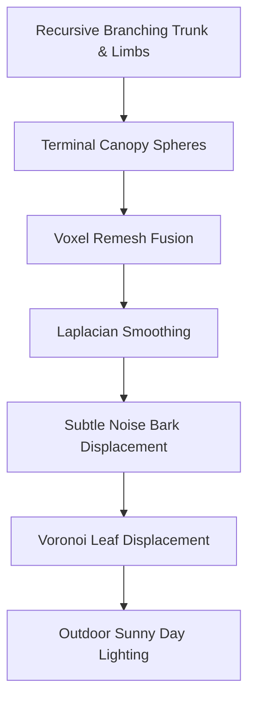

# Procedural Organic Tree Generation

A beautiful, photorealistic **organic tree** procedurally generated from scratch in Blender using a recursive branching algorithm, advanced voxel fusion, Laplacian smoothing, and high-frequency micro-displacement texturing. 

Below is the design breakdown, procedural steps, rendered assets, and standalone script.

---

## 🌳 Architectural & Procedural Design

The tree is built through a three-stage geometric pipeline:



1. **Recursive Branching Engine:** Cylinder segments are recursively spawned with decreasing length (`* 0.72`) and radius (`* 0.65`) from the base origin. Each bifurcation uses randomized natural pitch and yaw angles to replicate authentic botanical growth. 
2. **Watertight Roots:** 4 thick sloping cylinder roots are spawned at the base (`z = 0`) to anchor the trunk dynamically into the ground.
3. **Organic Voxel Fusion:** All branches and roots are joined and fused into a single watertight volume using a **Voxel Remesh** (`voxel_size = 0.05`).
4. **Laplacian Wood Smoothing:** Blends the joints between the main trunk, roots, and limbs. The rigid cylinder junctions disappear, replaced by smooth, natural wood grain transitions.
5. **Lush Leaf Canopy:** Leaf spheres are spawned at every terminal branch tip, joined together, voxel-remeshed (`voxel_size = 0.08`), and heavily displaced with a **Voronoi Noise Texture** (`strength = 0.28`). This creates an incredibly detailed, organic, leafy canopy silhouette that simulates millions of individual leaves.
6. **Procedural Bark & Leaf Shaders:** 
   - **Bark:** A dark, organic rich brown Principled BSDF (`roughness = 0.92`) mapped with a strong Noise Texture Bump to generate deep, realistic bark relief.
   - **Leaves:** A vibrant yellow-green organic shader (`roughness = 0.45`) with leaf-like micro-bumps.

---

## ☀️ Sunny Day Light Rig & Camera

* **Golden Sun Key Light:** A powerful sun light (`energy = 8.0`, color `1.0, 0.98, 0.95`) angled from the upper-left casts soft, realistic leaves shadows down onto the ground.
* **Blue Sky Ambient Fill Light:** A secondary sun light (`energy = 2.0`, color `0.72, 0.86, 1.0`) provides cool sky bounce light to illuminate shadow areas.
* **Mossy Ground:** A large moss-green ground plane anchors the tree roots.
* **Wide-Angle Camera:** A 32mm wide-angle lens frames the entire majestic tree in a low-angle perspective, creating a grand, heroic composition.

---

## 🖼️ Visualizations & Output Renders

The renders capture the smooth transitions of the wood and the lush organic silhouette of the foliage canopy:

````carousel

<!-- slide -->

````

### Saved Output Paths:
* **Blender Model Scene:** [albero.blend](file:///C:/Users/andre/Desktop/Nuova%20cartella%20(5)/albero.blend) (The complete 3D model scene!)
* **Production Eevee Render:** [albero_render_0001.png](file:///C:/Users/andre/Desktop/Nuova%20cartella%20(5)/albero_render_0001.png) (1920x1080 resolution)
* **Viewport LookDev Preview:** [albero.png](file:///C:/Users/andre/Desktop/Nuova%20cartella%20(5)/albero.png)
* **Standalone Executable Script:** [generate_tree.py](file:///C:/Users/andre/.gemini/antigravity-cli/brain/bf0fdf96-df65-451f-a3dd-ee395072dc69/scratch/generate_tree.py)

---

## 🐍 Standalone Executable Python Script
The standalone script to regenerate this complete organic tree is saved directly in your scratch folder as [generate_tree.py](file:///C:/Users/andre/.gemini/antigravity-cli/brain/bf0fdf96-df65-451f-a3dd-ee395072dc69/scratch/generate_tree.py).

Run it inside Blender or headlessly with:
```bash
blender -b -P "C:\Users\andre\.gemini\antigravity-cli\brain\bf0fdf96-df65-451f-a3dd-ee395072dc69\scratch\generate_tree.py"
```
